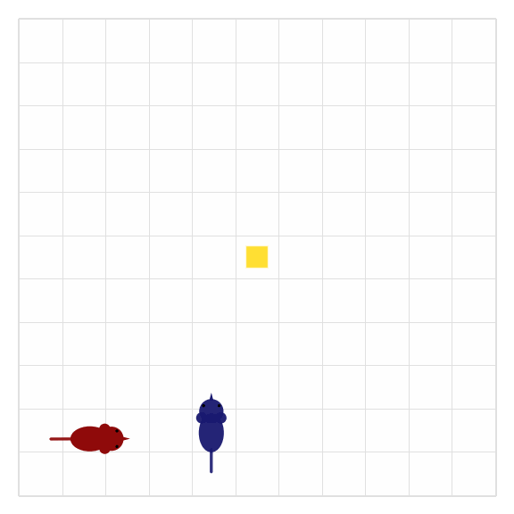

Gallery
=======

The gallery is where environment behavior becomes visible. Each entry is generated from
a script in ``visualize/`` so the site stays reproducible. The homepage uses the live
browser version first; this page keeps the generated assets for inspection.

Cooperative Gridworld
---------------------

Two agents run several cooperation trials. Each trial starts from a different pair of
positions, activates the center, reveals a new target, and collects together.

Asset script
------------

.. code-block:: bash

   conda run -n marlax python visualize/cooperative_grid.py

Browser Demo
------------

The front page uses a JavaScript canvas simulation instead of a GIF. The policy is
stochastic and value-driven so it can recover after an agent is dragged or nudged away
from the task. The current browser policy is a small stand-in for exported Q-values;
the storage layer will make this load real learned tables next.
